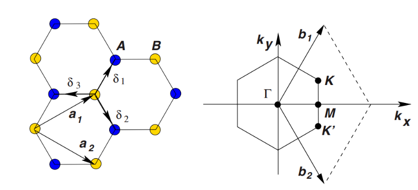
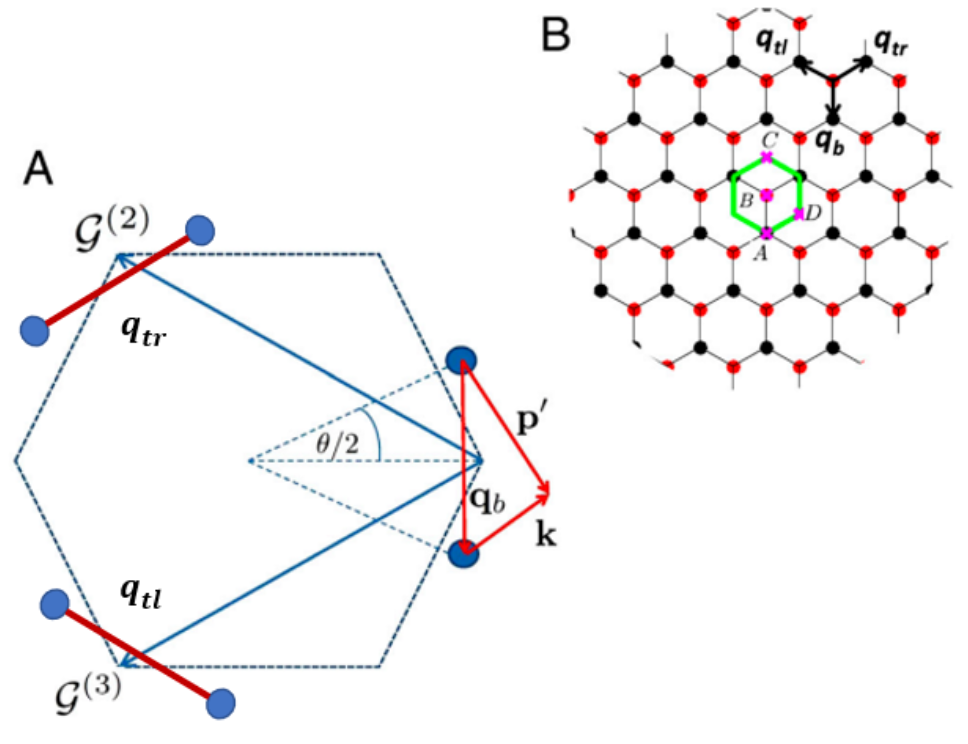
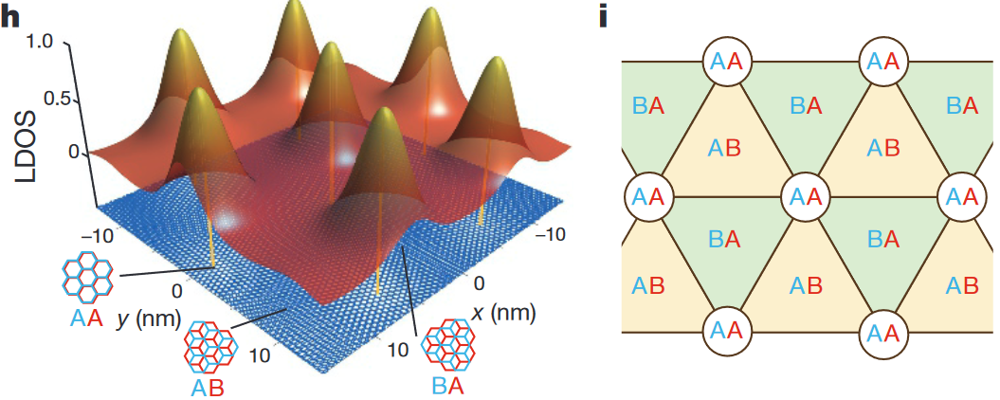
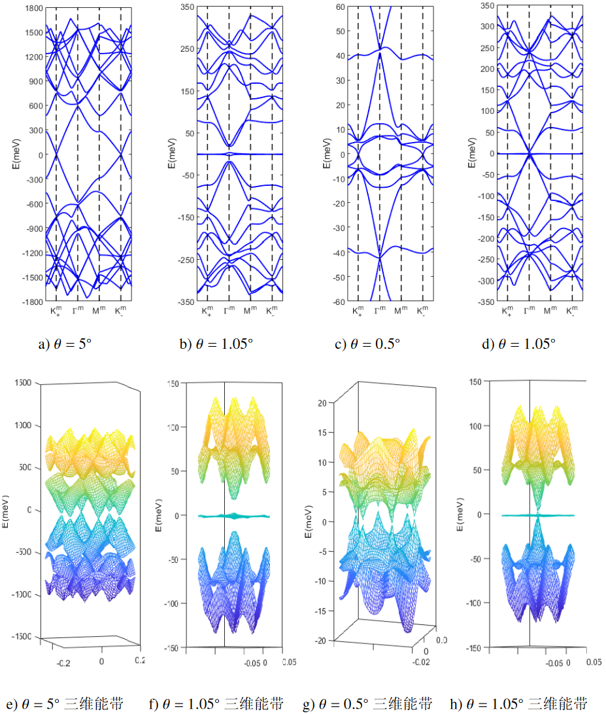
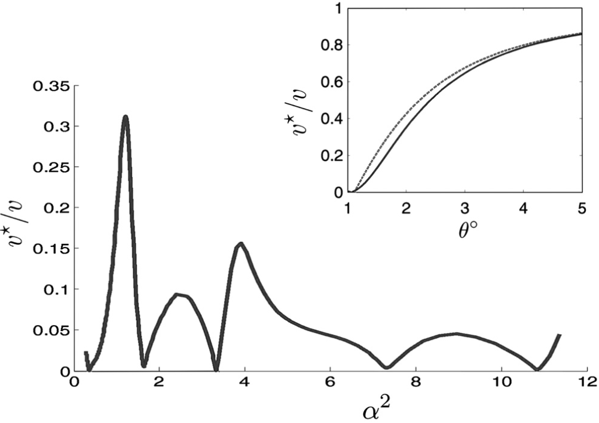

内容总结于:
1. 转角石墨烯的实验研究.胡皓东.2022.上海交通大学
2. 氢元素低维纳米结构制备及近场光学表征.吕博赛.2022.上海交通大学
3. Moiré bands in twisted double-layer graphene.Rafi Bistritzer and Allan H. MacDonald.2011. PNAS

# 单层石墨烯

## 晶格

对于单层石墨烯而言, 晶格基矢可以写作

$$
\begin{equation}
\vec{a}_{1} = \frac{a}{2}(3, \sqrt{3}),
\vec{a}_{2} = \frac{a}{2}(3,-\sqrt{3}).
\end{equation}
$$

>$a \approx 1.42 \r A$ 为碳碳键长度. 

根据倒格矢公式可以计算出倒格基矢

$$
\begin{equation}
\vec{b}_{1} = \frac{2 \pi}{3 a} ( 1, \sqrt{3} ), 
\vec{b}_{2} = \frac{2 \pi}{3 a} ( 1, -\sqrt{3}).
\end{equation}
$$

而三个最近邻矢量则是

$$
\begin{equation}
\delta_{1} = \frac{a}{2}(1, \sqrt{3}), 
\delta_{2} = \frac{a}{2}(1, -\sqrt{3}), 
\delta_{3} = a( -1, 0 )
\end{equation}
$$

用图示来表达这些矢量:

>狄拉克锥即位于$K,K'$点.

在后文中所用到的倒格矢 $\vec{G}_1, \vec{G}_2$ 即可从该处导出. 

当我们对倒格矢指标求和从而采取截断时, 我们的方法是采用 $\vec{0}, \mathcal{G}^{(2)}, \mathcal{G}^{(3)}$, 它们对应的是

>虚线圈出的范围是指的旋转前的单层石墨烯的第一布里渊区.
>
> $\vec{0}, \mathcal{G}^{(2)}, \mathcal{G}^{(3)}$ 连接的是三个等效的狄拉克点.
>蓝色圆点表示的是旋转后的上下两层石墨烯的狄拉克点.

## 紧束缚模型

只考虑最近邻跃迁,即三个最近邻矢量, 可以写出对应的哈密顿量:

$$
\begin{equation}
\hat{H} = t\sum_{i,j = \langle i\rangle}a_{i}^{\dagger}b_{j} + h.c..
\end{equation}
$$

>$t\approx 2.7 eV$ 为跃迁系数(最近邻跃迁能量), $a_{i}^{\dagger}$ 为在 $i$ 位置产生一个电子的产生算符, $b_{j}$ 为在 $j$ 位置湮灭一个电子的湮灭算符.

使用傅里叶变换将升降算符写成动量空间的形式:

$$
\begin{equation}
a_{i} = \sum_{\vec{k}}e^{i\vec{k}\cdot\vec{r}_{i, A}}a_{\vec{k}},
b_{i} = \sum_{\vec{k}}e^{i\vec{k}\cdot\vec{r}_{i, B}}b_{\vec{k}}.
\end{equation}
$$

将上式代入到哈密顿量的式子中, 即有

$$
\begin{equation}
\hat{H} = \sum_{\vec{k}}h(\vec{k})=t\sum_{\vec{k}}f(\vec{k})a_{\vec{k}}^{\dagger}b_{\vec{k}} + h.c..
\end{equation}
$$

>$f(\vec{k}) = e^{i\vec{k}\cdot\delta_{1}} + e^{i\vec{k}\cdot\delta_{2}} + e^{i\vec{k}\cdot\delta_{3}} = \sum_{i = 1}^{3}e^{i\vec{k}\cdot\delta_{i}}$.

对这个哈密顿量求本征值, 即有本征能量为

$$
\begin{equation}
E_{\pm}(\vec{k}) = \pm t|f(\vec{k})|
= \pm t\sqrt{3 + 2\cos\left(\sqrt{3}k_{x}a\right) + 4\cos\left(\frac{\sqrt{3}}{2}k_{x}a\right)\cos\left(\frac{3}{2}k_{y}a\right)}
\end{equation}
$$

# 超晶格-转角双层石墨烯

## Commensuration (共格, 相称)

要产生共格现象, 就需要摩尔超晶格的原胞基矢能够由整数个原晶格基矢组成. 

用公式描述即有

$$
\begin{equation}
\vec{A}_{1} = n\vec{a}_1 + m\vec{a}_2,
\vec{A}_{2} = -m\vec{a}_1 + (n + m)\vec{a}_2
\end{equation}
$$

---
>在一个摩尔超晶格中往往会含有上千个原子, 大大超过了密度泛函理论的运算上限, 所以需要使用近似方法.
## 紧束缚模型
因为层间距离 $\approx 0.3 nm$, 大于碳碳键长度 $a \approx 0.14 nm$, 所以不考虑层间杂化.

写出紧束缚哈密顿量:

$$
\begin{equation}
\hat{H} = \sum_{i,j}\omega(i,j)c_{i}^{\dagger}c_{j} + h.c.
\end{equation}
$$

>$i,j$ 是原胞中的原子指标, $c_{i}^{\dagger}$ 为在 $i$ 位置产生一个电子的产生算符, $c_{j}$ 为在 $j$ 位置湮灭一个电子的湮灭算符, $\omega(i,j)$ 为跃迁参数.

描述跃迁参数的公式是这样的:

$$
\begin{equation}
\omega(i,j) = V_{\pi}[1-(\frac{\vec{d}_{ij}\cdot\hat{z}}{d_{ij}})^2]e^{-\frac{d_{ij}-a_{0}}{\delta}} + V_{\sigma}(\frac{\vec{d}_{ij}\cdot\hat{z}}{d_{ij}})e^{-\frac{d_{ij}-d_{0}}{\delta}}
\end{equation}
$$

>$\vec{d}_{ij} = \vec{r}_{i} - \vec{r}_{j}$
>是原子间位移矢量.
>而 $V_{\pi} = -2.7 eV$ 为 $\pi$ 键的跃迁参数, 
$V_{\sigma} = 0.48 eV$ 为 $\sigma$ 键的跃迁参数, 
$a_{0} = 0.142 nm$ 为碳碳键长度, 
$d_{0} = 0.335 nm$ 为层间距离, 
$\delta = 0.045 nm$ 为衰减长度.

和单层石墨烯中的计算处理一样, 我们需要将这里的升降算符通过傅里叶变换写成动量空间的形式:

$$
\begin{equation}
c_{i} = \sum_{\vec{k}}e^{i\vec{k}\cdot(\vec{r}_{i} + \vec{R})}c_{\vec{k}}^{I}
\end{equation}
$$

>$\vec{R}$ 是包含第i个原子的原胞的原点绝对位置, $\vec{r}_{i}$ 则是相对于原胞内原点的相对位移, $I = 1,\dots,N$ 则是指的原胞内第 $i$ 个原子.

代入后得到哈密顿量的动量形式:

$$
\begin{equation}
\hat{H} = \sum_{\vec{k}}h(\vec{k}) = \sum_{\vec{k}}\sum_{I,J}h_{IJ}(\vec{k})c_{\vec{k}}^{I,\dagger}c_{\vec{k}}^{J} + h.c..
\end{equation}
$$

>$h_{IJ}(\vec{k}) = \sum_{\vec{R}}\omega(\vec{r}_{I}+\vec{R},\vec{r}_{J})e^{i\vec{k}\cdot(\vec{r}_{I}+\vec{R}-\vec{r}_{J})}$
>为跃迁矩阵.

然而, 对于 $N \approx 10^4$ 的数据规模进行对角化是十分困难的.

>$N \approx 10^4$ 这个数字来源于这样的计算:摩尔超晶格原胞面积变为原先的 $\theta^{-2}$ 倍, 则其中的原子数量也增长了 $\theta^{-2}$ 倍, 所以对于 $\theta \approx 1\degree$ 的TBG, 超晶格的原胞大约存在 $10^{4}$ 个原子.

~~未给出具体计算方法~~

紧束缚模型可以准确给出能带结构, 但是其角度是从原子和原子之间的相互作用出发的, 而并不能和摩尔超晶格联系起来.

## 连续模型

在低能条件下, 连续模型不仅适用于共格的摩尔超晶体, 也同样适用于并无共格性的叠加晶体.

建立这样一个哈密顿量, 其中主对角线上的元素是单层石墨烯的狄拉克哈密顿量, 而副对角线上的元素则是描述层间跃迁的隧穿项.

对于单层的石墨烯, 其狄拉克哈密顿量是这样表示的:

$$
\begin{equation}
h_{\vec{K}}(\vec{q})=\hbar v_{F}|\vec{q}|
\begin{bmatrix}
0 & e^{-i\theta_{\vec{q}}}  \\
e^{i\theta_{\vec{q}}} & 0   \\
\end{bmatrix}
\end{equation}
$$

>$\theta_{\vec{q}} = \tan^{-1}(q_{y}/q_{x})$

所以对于相对转角为 $\theta$ 的双层石墨烯, 其单层的狄拉克哈密顿量可以分别写作:

$$
\begin{equation}
h_{\vec{K}}^{1}(\vec{q})=\hbar v_{F}|\vec{q}|
\begin{bmatrix}
0 & e^{-i(\theta_{\vec{q}}+\theta/2)}  \\
e^{i(\theta_{\vec{q}}+\theta/2)} & 0   \\
\end{bmatrix}
=\hbar v_{F}\sigma^{\theta/2}\cdot\vec{q},
\end{equation}
$$

$$
\begin{equation}
h_{\vec{K}}^{2}(\vec{q})=\hbar v_{F}|\vec{q}|
\begin{bmatrix}
0 & e^{-i(\theta_{\vec{q}}-\theta/2)}  \\
e^{i(\theta_{\vec{q}}-\theta/2)} & 0   \\
\end{bmatrix}
=\hbar v_{F}\sigma^{-\theta/2}\cdot\vec{q}.
\end{equation}
$$

它们各自作用在单层石墨烯的 $A$, $B$ 子格上, 所以对于整体的哈密顿量而言, 是作用在
$\begin{bmatrix}
\alpha_{\vec{q}} \\
\beta_{\vec{q}} \\
\end{bmatrix}$
这样一个两分量的旋量上的. 

接下来要解决的时层间隧穿项. 
我们将层间跃迁的矩阵元写出来:

$$
\begin{equation}
T_{\vec{k}\vec{p}'}^{\alpha\beta} = 
\langle \Psi_{\vec{k}\alpha}^{(1)}|\hat{H_{T}}|\Psi_{\vec{p}'\beta}^{(2)}\rangle
\end{equation}
$$

>该矩阵元描述的是一个动量为 $\vec{p}'=M(\theta)\vec{p}$ 的电子,在第二层的 $\beta$ 子格上, 通过层间跃迁到第一层的 $\alpha$ 子格上, 成为动量为 $\vec{k}$ 的态的过程, $M(\theta)$ 是一个旋转矩阵.

我们用紧束缚模型的思路将波函数的形式写出来:

$$
\begin{equation}
|\Psi_{\vec{k}\alpha}^{(1)}\rangle=\frac{1}{\sqrt{N}}\sum_{\vec{R}}e^{i\vec{k}\cdot(\vec{R}+\vec{\tau}_{\alpha})}|\vec{R}+\vec{\tau}_{\alpha}\rangle,
\end{equation}
$$

$$
\begin{equation}
|\Psi_{\vec{p}'\beta}^{(2)}\rangle=\frac{1}{\sqrt{N}}\sum_{\vec{R'}}e^{i\vec{p}'\cdot(\vec{R'}+\vec{\tau}_{\beta}')}|\vec{R'}+\vec{\tau}_{\beta}'\rangle.
\end{equation}
$$

>$\tau_{A} = 0, \tau_{B} = \tau$. $\vec{R}$ 是对所有三角布拉维格子求和的指标.

我们不妨选取 $AB$ 堆叠处作为原点, 那么就有关系式

$$
\begin{equation}
\vec{R'} = M(\theta)(\vec{R}-\tau) + d
\end{equation}
$$

>$d$ 是层间间距.

将波函数代入到层间跃迁矩阵元中, 并且采用**两中心近似**, 就能得到层间跃迁矩阵元:

$$
\begin{equation}
T_{\vec{k}\vec{p}'}^{\alpha\beta}=\frac{1}{N}
\sum_{\vec{R}}\sum_{\vec{R}'}
e^{i[-\vec{k}(\vec{R}+\tau_{\alpha})+\vec{p}'(\vec{R}'+\tau_{\beta}')]}
t(\vec{R}+\tau_{\alpha}-\vec{R}'-\tau_{\beta}')
\end{equation}
$$

>两中心近似, 指的是假设电子只和起始原子和终止原子之间的原子相互作用, 而忽略了其他原子的影响. 用公式可以这样描述:
>$$
>\begin{equation}
>\langle\vec{R}+\tau_{\alpha}|\hat{H_T}|\vec{R'}+\tau_{\beta}'\rangle = t(\vec{R}+\tau_{\alpha}-\vec{R}'-\tau_{\beta}')
>\end{equation}
>$$
>因为转角双层石墨烯中碳碳键很小, 所以这个式子用来描述电子跃迁的过程非常好用.

利用傅里叶变换, 我们可以将两中心近似所用的式子转为动量空间的形式.

$$
\begin{equation}
T_{\vec{k}\vec{p}'}^{\alpha\beta}=\frac{1}{N^2}
\sum_{\vec{R}}\sum_{\vec{R}'}\sum_{\vec{q}_1}\sum_{\vec{q}_2}
e^{i[-\vec{k}(\vec{R}+\tau_{\alpha})+\vec{p}'(\vec{R}'+\tau_{\beta}')]}
e^{i[\vec{q}_1(\vec{R}+\tau_{\alpha})-\vec{q}_2(\vec{R}'+\tau_{\beta}')]}
\frac{t_{\vec{q}}}{\Omega}
\end{equation}
$$

这个式子非常长, 但是我们可以通过一些和式结论来简化这个式子:

$$
\begin{equation}
\sum_{\vec{R}}e^{i(\vec{q}_1-\vec{k})\vec{R}} = N\delta_{\vec{q}_1-\vec{k}, \vec{G}_1}, 
\end{equation}
$$

$$
\begin{equation}
\sum_{\vec{R}'}e^{-i(\vec{q}_2-\vec{p}')(\vec{R}'-\vec{d}+\tau')} = N\delta_{\vec{q}_2-\vec{p}', \vec{G}_2'}.
\end{equation}
$$

最后我们就得到了层间跃迁矩阵元:

$$
\begin{equation}
T_{\vec{k}\vec{p}'}^{\alpha\beta}=\sum_{\vec{G}_1\vec{G_2}}\frac{t_{\overline{\vec{k}}+\vec{G}_1}}{\Omega}
e^{i[\vec{G}_1\tau_{\alpha}-\vec{G}_2(\tau_{\beta}-\tau)-\vec{G}_2'\vec{d}]}\delta_{\overline{\vec{k}}+\vec{G}_1,\overline{\vec{p}}'+\vec{G}_2'}
\end{equation}
$$

> $\Omega$ 是原胞面积, 
$t_{\vec{q}}$ 是隧穿幅值 $t(\vec{r})$ 的傅里叶变换, 
$\vec{G}_1, \vec{G}_2$ 是倒格矢, 上标代表
$\vec{G}_i = M(\theta)\vec{G}_i$. 
而上划线则表示动量起点是布里渊区的中心.

对于狄拉克点附近的动量而言,  如果要让 $t_q$ 值足够大, 那么可以对层间矩阵元 $T_{\vec{k}\vec{p}'}^{\alpha\beta}$ 中的 $\vec{G}_1$指标采取截断, 
具体来说就是只保留 $\vec{0},\mathcal{G}^{(2)}, \mathcal{G}^{(3)}$ 三项.

>注意到总有关系式
>$$
>\begin{equation}
>\overline{\vec{k}} + \vec{G}_1 = \overline{\vec{p}}' + \vec{G}_2'
>\end{equation}
>$$
>成立

所以当 $\vec{G}_1$ 被选定, 实际上对应的 $\vec{G}_2'$ 可以被选定(这意味着跃迁发生在一层狄拉克点邻域到另一层狄拉克点邻域).

再回头看看前面晶格部分内容里展示的 

我们假定, 在低能模型下, 只有 $q_b, q_{tr}, q_{tl}$ 对应的三个跃迁过程有意义. 具体到电子态, 即

$$
\begin{equation}
\begin{aligned}
|\vec{k}_{\alpha}^{(1)}\rangle \rightarrow 
|(\vec{k}+\vec{k}_{\theta})_{\beta}^{(2)}\rangle \\

|\vec{k}_{\alpha}^{(1)}\rangle \rightarrow
|(\vec{k}+\vec{k}_{\theta}-\vec{G}_1)_{\beta}^{(2)}\rangle \\

|\vec{k}_{\alpha}^{(1)}\rangle \rightarrow
|(\vec{k}+\vec{k}_{\theta}-\vec{G}_2)_{\beta}^{(2)}\rangle
\end{aligned}
\end{equation}
$$

>$$
>|k_{\theta}| = |\vec{K} - \vec{K}'| = 2k_{D}\sin{\frac{\theta}{2}}
>$$

其对应的跃迁矩阵元中的分量即为

$$
\begin{equation}
\begin{aligned}
T_{1} &= \frac{t_{k_{D}}}{\Omega}
\begin{bmatrix}
    1 & 1\\
    1 & 1\\
\end{bmatrix},\\

T_{2} &= \frac{t_{k_{D}}}{\Omega}e^{-i\mathcal{G}^{(2)'}\cdot\vec{d}}
\begin{bmatrix}
    e^{-i\Phi} & 1\\
    e^{i\Phi} & e^{-i\Phi}\\
\end{bmatrix},\\

T_{3} &= \frac{t_{k_D}}{\Omega}e^{-i\mathcal{G}^{(3')}\cdot\vec{d}}
\begin{bmatrix}
e^{i\Phi} & 1\\
e^{-i\Phi} & e^{i\Phi} \\
\end{bmatrix}
\end{aligned}
\end{equation}
$$

> $\phi = 2\pi/3$, 该数值来源于 $\mathcal{G}^{(2)}\cdot\tau$
>
> 四个矩阵元分别指代 $AA, AB, BA, BB$ 四种跃迁的子格排布.

前面我们已经提到, 对于一个超晶格网络上的态 $|(\vec{k}+m\vec{G_1}+n\vec{G_2})^{1}\rangle$ 对应三个跃迁过程:

$$
\begin{equation}
\begin{aligned}
|(\vec{k}+m\vec{G_1}+n\vec{G_2})^{(1)}\rangle\rightarrow|(\vec{k}+\vec{k}_{\theta}+m\vec{G_1}+n\vec{G_2})^{(2)}\rangle,\\

|(\vec{k}+m\vec{G_1}+n\vec{G_2})^{(1)}\rangle\rightarrow|(\vec{k}+\vec{k}_{\theta}+(m - 1)\vec{G_1}+n\vec{G_2})^{(2)}\rangle,\\

|(\vec{k}+m\vec{G_1}+n\vec{G_2})^{(1)}\rangle\rightarrow|(\vec{k}+\vec{k}_{\theta}+m\vec{G_1}+(n - 1)\vec{G_2})^{(2)}\rangle
\end{aligned}
\end{equation}
$$

>$$
>m = -M, \dots,-1, 0, 1, \dots, M
>$$
>
>$$
n = -N, \dots,-1, 0, 1, \dots, N
>$$
>
>一般采取 $M = N = 4$ 的截断即可取得理想计算结果.

使用指标 $\vec{q}$ 来替换 $\vec{k}$, 具体来说是

$$
\vec{q} = \vec{k} - \vec{K}
$$

所以我们就可以定义基底

$$
\begin{equation}
|q\rangle=
\begin{bmatrix}
|(\vec{q}-M\vec{G}_1-N\vec{G}_2)^{(1)}\rangle\\
|(\vec{q}-(M-1)\vec{G}_1-N\vec{G}_2)^{(1)}\rangle\\

\dots\\
|(\vec{q}+M\vec{G}_1-N\vec{G}_2)^{(1)}\rangle\\
|(\vec{q}-M\vec{G}_1-(N-1)\vec{G}_2)^{(1)}\rangle\\
|(\vec{q}-(M-1)\vec{G}_1-(N-1)\vec{G}_2)^{(1)}\rangle\\
\dots\\
|(\vec{q}+M\vec{G}_1-(N-1)\vec{G}_2)^{(1)}\rangle\\
|(\vec{q}+M\vec{G}_1+N\vec{G}_2)^{(1)}\rangle\\
\dots\\
|(\vec{q}+\vec{k}_{\theta}-M\vec{G}_1-N\vec{G}_2)^{(2)}\rangle\\
\dots\\
|(\vec{q}+\vec{k}_{\theta}+M\vec{G}_1+N\vec{G}_2)^{(2)}\rangle\\
\end{bmatrix}
\end{equation}
$$

>计算可知该基底长度为 $(2M+1)(2N+1)$

其中的每个姿态都对应着 $A/B$ 子格的二分量旋量.

我们写出整个系统的哈密顿量:

>接下来的公式会很长: 确保你的 Markdown 阅读器支持滑轮显示公式, ~~或者使用带鱼屏~~.

$$
\begin{equation}
h^{\vec{K}}(\vec{q})
=h_{ij}=
\begin{bmatrix}
h_{\vec{K}}^{(1)}(\vec{q}-M\vec{G}_1-N\vec{G_2}) & 0 &\dots& 0 & T^{1} & 0 & \dots & 0\\
0 & h_{\vec{K}}^{(1)}(\vec{q}-(M - 1)\vec{G}_1-N\vec{G_2}) &\dots & 0 & T^{2} & T^{1} & \dots & 0\\
\vdots & \vdots & \ddots & \vdots & \vdots & \vdots & \ddots & \vdots\\
0 & 0 & \dots & h_{\vec{K}}^{(1)}(\vec{q}+M\vec{G}_1+N\vec{G_2}) & 0 & 0 & \dots & T^{1}\\
T^{1\dagger} & T^{2\dagger} & \dots & 0 & h_{\vec{K}}^{(2)}(\vec{q}+\vec{k}_{\theta}-M\vec{G}_1-N\vec{G_2}) & 0 & \dots & 0\\
0 & T^{1\dagger} & \dots & 0 & 0 & h_{\vec{K}}^{(2)}(\vec{q}+\vec{k}_{\theta}-(M - 1)\vec{G}_1-N\vec{G_2}) & \dots & 0\\
0 & 0 & \dots & 0 & 0 & 0 & \cdots & 0\\
0 & 0 & \dots & T^{1\dagger} & 0 & 0 & \dots & h_{\vec{K}}^{(2)}(\vec{q}+\vec{k}_{\theta}+M\vec{G}_1+N\vec{G_2})\\
\end{bmatrix}
\end{equation}
$$

>对角矩阵元是旋转后的单层狄拉克哈密顿量; 非对角元代表态之间的跃迁矩阵. 因为我们只考虑了最近邻跃迁, 所以非对角元只有 $0, T^{1}, T^{2}$ 三种.

由此得到总哈密顿量

$$
\begin{equation}
\hat{H}^{\vec{k}}_{ctn}=\sum_{\vec{q}}h^{\vec{K}}(\vec{q})|\vec{q}\rangle\langle\vec{q}|
\end{equation}
$$

连续模型在这里还需要对进行进一步的修正.

在上述的模型中， 我们架设了单层石墨烯晶格是刚性的， 即保持参数 $a = 0.142nm$ 和 $d = 0.33nm$ 不变, 但是为了使得系统处于稳定性(也就是 $\partial_{\vec{x}}U=0$), 碳原子实际上会尽可能避免靠得太近.

转角双层石墨烯具有不同的堆叠类型:
- $AA(BB)$ 型: 上下两层子格完全相同, 位置垂直对齐;
- $AB$ 型: 上层的 $A$ 原子与下层的 $B$ 原子对齐, 而上层的 $B$ 原子与下层的 $A$ 原子并不对齐;
- $BA$ 型 : 上层的$B$ 原子与下层的 $A$ 原子对齐, 而上层的 $B$ 原子与下层的 $A$ 原子并不对齐.

我们从曹原给出的参考图来体会这三种类型, 以及它们是如何整体体现在晶格网络上的:

对于转角双层石墨烯, **弛豫效应**也会对电子能带产生显著影响.

>弛豫效应
>
>在这里的语境下指的是材料中的原子位置会因为某些扰动而发生微小位移, 在计算能带的时候需要将这种位移考虑进去.

$AA$ 堆叠中原子相互靠得很近, 这会使得势能变得更高, 所以会存在一种趋势, 使得 $AA$ 区域发生扭曲与拉伸, 从而接近于 $AB$ 堆叠区域. 这样的趋势会带来两种后果:
- $d_{AA}>d_{AB}=d_{BA}$. 我们将这种行为称为屈伸($\text{builkling}$)或者褶皱($\text{corrugation}$);
- $AA$ 区域面积收缩, 使得 $AA$ 区域转动更大, $AB$ 区域转动更小.

于是就形成了图上右部分的拓扑连接的结构.

在[转角石墨烯中的摩尔能带](/notes/Moire%20bands%20in%20twisted%20double-layer%20graphene.md#"target")一文中我们已经知道, 转角双层石墨烯的能谱在 $\theta\neq 0$ 时, 与 $\vec{d}$ 无关. 所以我们可以把 $T_1, T_2, T_3$ 重写一遍:

$$
\begin{equation}
\begin{aligned}
T_1=w\begin{bmatrix}
1 & 1\\
1 & 1\\
\end{bmatrix},\\

T_2=w\begin{bmatrix}
1 & \omega^{\star}\\
\omega & 1\\
\end{bmatrix},\\

T_3=w\begin{bmatrix}
1 & \omega\\
\omega^{\star} & 1\\
\end{bmatrix}.
\end{aligned}
\end{equation}
$$

为了引入弛豫效应, 我们引入 $w'<w$, 它代表着 $AA$ 堆叠中有着更大的 $a$ 和更小的 堆叠区域面积. 于是我们就有

$$
\begin{equation}
\begin{aligned}
T_1=\begin{bmatrix}
w' & w\\
w & w'\\
\end{bmatrix},\\

T_2=\begin{bmatrix}
w' & w\omega^{\star}\\
w\omega & w'\\
\end{bmatrix},\\

T_3=\begin{bmatrix}
w' & w\omega\\
w\omega^{\star} & w'\\
\end{bmatrix}.
\end{aligned}
\end{equation}
$$

>$w = \frac{t_{k_{D}}}{\Omega}, \omega = e^{i2\pi/3}$

我们分别求解'不考虑弛豫效应'和'考虑弛豫效应'的情况下的能带结构, 可以得到其对比图像:

>该图引自:转角石墨烯的实验研究.胡皓东.2022.上海交通大学.
>
>其中, 我们重点对比 (b) 和 (d)(或者(f)和(h)), (d) 和 (h) 是未考虑弛豫效应的情况.
>不难发现, 弛豫效应使得 $\Gamma$ 点的能隙明显增大, 并且出现了新的能带, 该能带在很大的 $k$ 空间内都是近似相等的, 我们将这种能带称为平带.

平带使得能量为0时的态密度可以急剧增加, 而态密度会影响热学和电学等诸多性质.

同样是在[转角石墨烯中的摩尔能带](/notes/Moire%20bands%20in%20twisted%20double-layer%20graphene.md#"target")中, 作者介绍了狄拉克点速度随着 $\theta$ 变化的情况.

$$
\frac{v^{\star}}{v}=\frac{1-3\alpha^2}{1+6\alpha^2}
$$

>$\alpha = w/\hbar vk_{\theta}$

$$
\lim_{\alpha\rightarrow 0}\frac{v^{\star}}{v} = 1 -9\alpha^2
$$

>当$1 -9\alpha^{2}=0$, 这就是'魔角'$\theta_{1} \approx 1.1\degree$ 的来源.

对于后续的魔角, 对应的规一化狄拉克点速度图像则是这样的:

